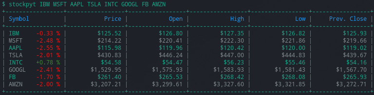

## Stock Python Ticker

A Stock Python Ticker for the terminal.

- Data scraped from Yahoo Finance
- No API keys required
- Has nice terminal gui with colors



### Usage
---

Simply pass the desired stock symbols as arguments to ```stockpyt```.

-   ```bash
    stockpyt IBM FB GOOGL
    ```

### Requirements
---

- Linux/Mac OS/WSL
- Python 3.8+

### Installation
---

Install directly from github with

-   ```bash
    pip install --user git+git://github.com/krywicki/stockpyt.git
    ```


